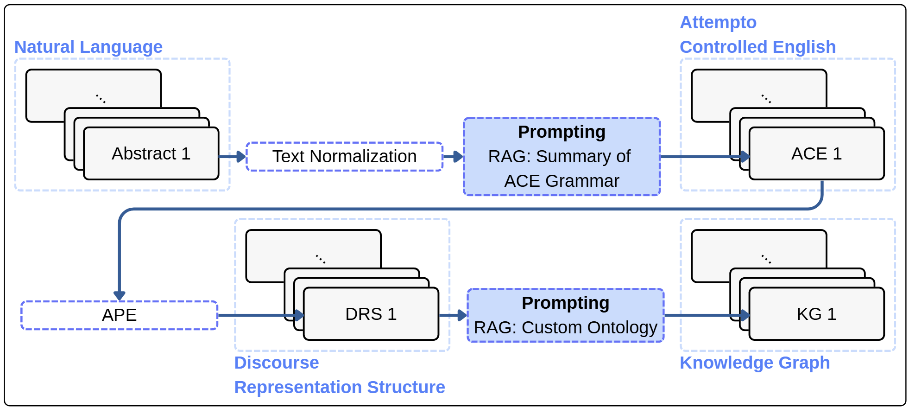
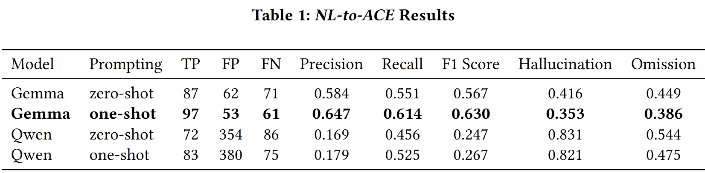
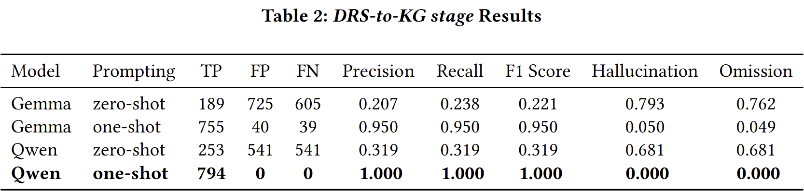

## Logical Reconstruction of Arguments in Publications
We present a framework which converts natural language scientific text into logical Knowledge Graphs (KGs). 
Through experiments of several prompting strategies with custom ontology on a curated corpus, we discover the operational bottlenecks in ontology building and relation extraction. Ultimately, this work offers foundational insights for leveraging Large Language Models (LLMs) to bridge unstructured literature with formal logical representations.
A short paper with further details is in [`archive/docs/logicalKG_shortpaper.pdf`](archive/docs/logicalKG_shortpaper.pdf).

## Motivation
Unstructured natural language in scientific publications masks the explicit logical connections between claims, premises, and evidence. Consequently, standard text analysis tools struggle to extract these underlying reasoning structures, hindering comprehensive knowledge synthesis.
 
## Features

In this work, we designed **NL → ACE → DRS → logical KG pipeline** converting  biomedical abstracts into Attempto Controlled English (ACE), then Discourse Representation Structures (DRS), then RDF/Turtle knowledge graphs based on the **Custom ontology (`ontology.ttl`)**

### Example through the pipeline

NL (normalized):

```text
Chemical_MESH_D000093542 treats Disease_MESH_D010190.
```

ACE:

```text
p:Chemical_MESH_D000093542 v:treat p:Disease_MESH_D010190 .
```

DRS:

```text
[A] predicate(A,treat,named(Chemical_MESH_D000093542),named(Disease_MESH_D010190))-1/6
```

KG:

```turtle
lkg:box_001 rdf:type lkg:DRSBox ;
    lkg:containsEntity lkg:Chemical_MESH_D000093542 , lkg:Disease_MESH_D010190 ;
    lkg:containsStatement lkg:stmt_001 .
lkg:stmt_001 rdf:type rdf:Statement ;
    rdf:subject lkg:Chemical_MESH_D000093542 ;
    rdf:predicate lkg:treat ;
    rdf:object lkg:Disease_MESH_D010190 .
```


## Code examples
All scripts assume the working directory is `logicalKG/`.

### 1. Build ground truth data

```bash
python data/nl/nl_gen.py
python data/ace/ace_gen.py
python data/drs/drs_gen.py
python data/kg/kg_gen.py
```

### 2. Run LLM prompting and evaluate

```bash
python prompting/nl_to_ace/test.py --model gemma-4-31b-it --prompt_type oneshot
python prompting/nl_to_ace/eval.py --model gemma-4-31b-it --prompt_type oneshot
python prompting/drs_to_kg/test.py --model gemma-4-31b-it --prompt_type oneshot
```

Omit the flags to use the script defaults. `eval.py` must use the same `--model` and `--prompt_type` as `test.py`. DRS-to-KG scoring is manual.


## Installation

### Requirements
- Python 3.10+
- Internet access is required to connect to the following external services: PubTator3 API (used in nl_gen.py), APE Web Service (used in drs_gen.py), and GWDG LLM API (used in test.py)

### Setup
```bash
git clone https://github.com/JihooChung/logicalKG
cd logicalKG
pip install pandas requests matplotlib
```

### API key
LLM prompting reads the key from `prompting/api_key.txt`:

```text
<your-gwdg-api-key>
```
See the [GWDG SAIA documentation](https://docs.hpc.gwdg.de/services/ai-services/saia/index.html) for how to obtain an API key.
**Do not commit this file if the repository is public.**

### Working directory
Run all scripts from `logicalKG/` so relative paths such as `./data/...` and `./prompting/...` resolve correctly.


## Tests
Generation scripts are not unit tests. Pass `--model` and `--prompt_type` (defaults: `gemma-4-31b-it`, `oneshot`):

```bash
python prompting/nl_to_ace/test.py --model gemma-4-31b-it --prompt_type oneshot
python prompting/drs_to_kg/test.py --model gemma-4-31b-it --prompt_type oneshot
python prompting/nl_to_ace/eval.py --model gemma-4-31b-it --prompt_type oneshot
```

- `model`: `gemma-4-31b-it`, `qwen3-30b-a3b-instruct-2507`, or another GWDG SAIA chat model
- `prompt_type`: `zeroshot` or `oneshot`

Outputs go to `prompting/.../results/{prompt_type}_{model}.csv`. Use the same flags for `eval.py` as for `test.py`. DRS→KG evaluation is **manual**.

If an abstract is too long, `nl_to_ace/test.py` splits `nl` on newlines; merge those rows by hand before evaluation.

## How to use and extend
1. Add papers to `data/data_list.csv` (same columns as the existing file).
2. Rebuild gold data with the scripts in Code examples (`nl_gen` → `ace_gen` → `drs_gen` → `kg_gen`). ACE gold is edited in `data/ace/ace_gen_manual.txt` first.
3. Edit or add prompt files under `prompting/nl_to_ace/` and `prompting/drs_to_kg/prompts/`.
4. Rerun generation with `--model` / `--prompt_type` (and optional `--input_path` / `--output_path`).

## Results
We evaluate Gemma (`gemma-4-31b-it`) and Qwen (`qwen3-30b-a3b-instruct-2507`) under zero-shot and one-shot prompting on 10 gold abstracts. Metrics are TP / FP / FN, precision, recall, F1, hallucination (FP / (TP+FP)), and omission (FN / (TP+FN)).

**Table 1. NL→ACE.** Line-level match against gold ACE. One-shot Gemma is best (F1 0.630). Qwen over-generates (high FP / hallucination), so precision stays low even with one-shot.

**Table 2. DRS→KG.** Triple-level match against gold Turtle (manual scoring). One-shot helps both models a lot: Gemma reaches F1 0.950, Qwen 1.000. Zero-shot stays weak because of format and ontology errors.


## License
This project is licensed under the MIT License. See [LICENSE](LICENSE).